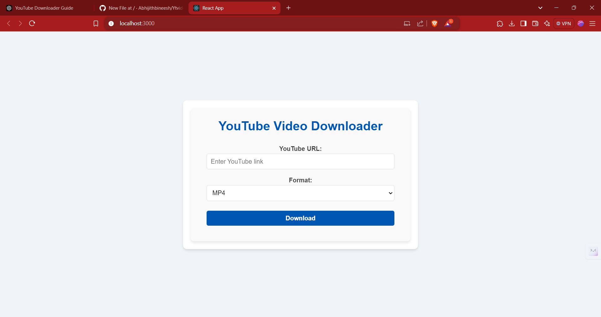
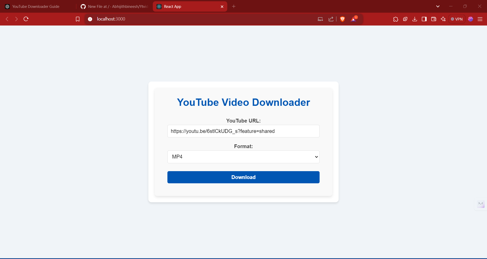
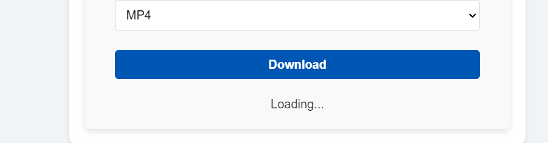
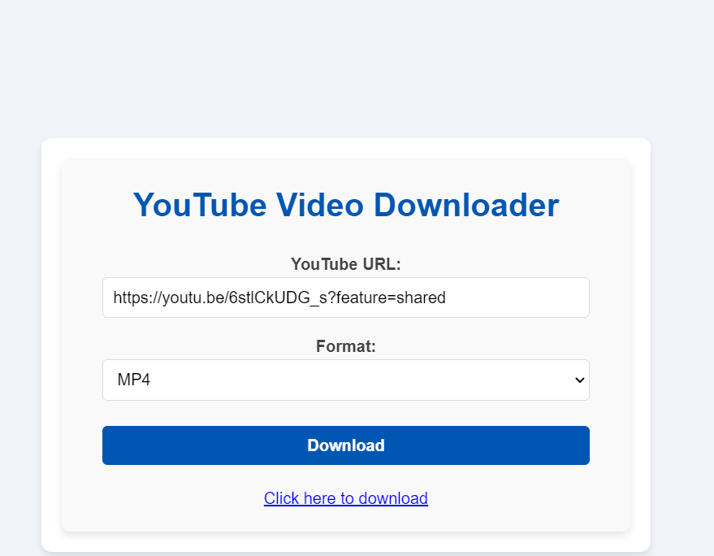
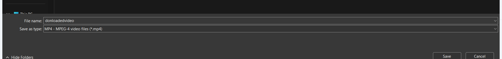

# YouTube Video and Audio Downloader

A simple YouTube video and audio downloader built using **React**, **Node.js**, and **Express**.

## Features

- Download YouTube videos in **MP4** format.
- Download YouTube audios in **MP3** format.
- Simple and easy-to-use interface to paste YouTube video URLs and select download formats.
- Backend powered by **ytdl-core** to fetch video and audio data.

## Tech Stack

- **Frontend**: React, Axios
- **Backend**: Node.js, Express, @distube/ytdl-core
- **Database**: N/A (No database used in this project)

## Screenshots


*Home Page*






## How to Use

1. Clone the repository:

    ```bash
    git clone https://github.com/Abhijithbineesh/Ytvideodownnloader.git
    cd Ytvideodownnloader
    ```

2. Install dependencies for both the backend and frontend:

    ```bash
    # Backend (server)
    cd server
    npm install

    # Frontend (React app)
    cd ../client
    npm install
    ```

3. Start the backend server:

    ```bash
    cd server
    node index.js
    ```

4. Start the React frontend:

    ```bash
    cd ../client
    npm start
    ```

5. Open the app in your browser at `http://localhost:3000` and start downloading YouTube videos and audios.

## Contributing

1. Fork the repository.
2. Clone your fork.
3. Create a new branch.
4. Make your changes.
5. Commit and push your changes.
6. Create a pull request.

## License

This project is licensed under the MIT License - see the [LICENSE](LICENSE) file for details.
